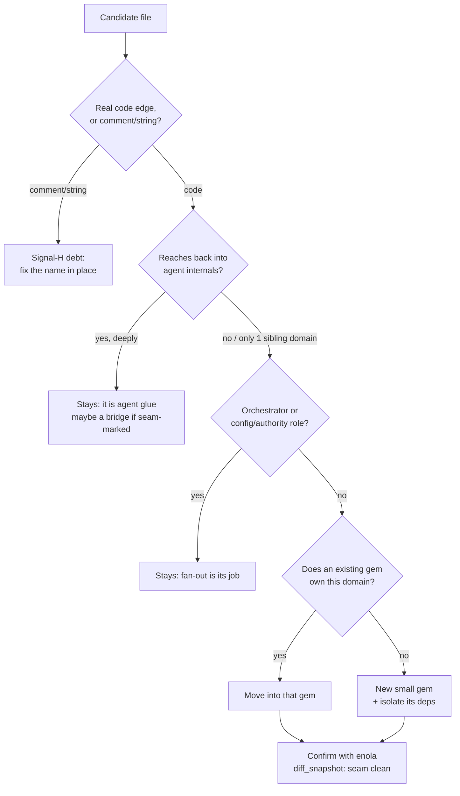

# 05 — A systematic method for finding misplaced code

The moves in [04](04-non-obvious-moves.md) were not found by reading files
top-to-bottom. They were found by running a small set of **signals** — each a
question with a command, a threshold, and a verdict — over the whole repo. This
document is that method, written so it can be re-run on `tamoz-agent` as it
shrinks, and on any gem, by anyone, later.

## The principle

Two rules decide where code belongs:

1. **Depth:** a symbol belongs in the _lowest_ gem that can satisfy its
   dependencies. If nothing it needs lives above gem X, it should not live above
   gem X either.
2. **Gravity:** code belongs with the domain it mostly talks to — _provided_
   nothing higher and more specific depends on it. A file that speaks almost
   entirely `tamoz-comms` and that only comms-shaped things consume is comms
   code, whatever folder it sits in.

Every signal below is an operational proxy for one of these two rules.

## The signals

Run these from the repo root. Each prints candidates; none is a verdict on its
own — the **guard** column is why.

### Signal 1 — De-facto public API (gravity, outbound)

_Which of a gem's symbols are consumed from other gems?_ Those are its real
public surface and belong at a boundary, not buried in a runtime.

```bash
grep -rhoE "Tamoz::Agent::[A-Z][A-Za-z0-9_]+" \
  $(grep -rlE "Tamoz::Agent::" gems --include='*.rb' | grep -v 'gems/tamoz-agent/') \
  | sort | uniq -c | sort -rn
```

- **Verdict:** high cross-gem fan-in → formalize as a public API (its own gem or
  a documented facade).
- **Guard:** the top consumer is usually `tamoz-evals` (a harness that sits
  _above_ everything) — that is legitimate consumption, not misplacement.
  Filter evals out to see peer/foundation consumers, which matter more.

### Signal 2 — Inversions (depth, the serious one)

_Do foundation/sibling gems reach **up** into a higher gem?_ This is the worst
smell: it is a latent cycle.

```bash
for g in core sqlite graph tools comms approval observability otel mcp stream telegram scheduler; do
  grep -rlE "Tamoz::Agent" gems/tamoz-$g/lib --include='*.rb' 2>/dev/null \
    | sed "s/^/tamoz-$g: /"
done
```

- **Verdict:** a real code reference from a lower gem to a higher one → invert it
  (move the shared thing down, or depend through an interface).
- **Guard — critical:** grep matches **comments and string literals** too. In
  this repo every hit was a comment or a serialization name map, _not_ a code
  edge (see [04-H](04-non-obvious-moves.md#h-stale-upward-references--fix-the-names-no-code-moves)).
  Always open the line: a comment is debt, a `require`/constant reference is a
  cycle. Confirm with `enola impact_analysis` on the symbol.

### Signal 3 — Single-consumer heavy dependency (depth)

_Which external gems does the gemspec carry for only one or two files?_ That dep
is taxing the whole gem for a sliver of code — isolate the code, drop the dep.

```bash
grep -rhoE "require ['\"][a-z_./]+['\"]" gems/<gem>/lib --include='*.rb' \
  | sort | uniq -c | sort -n
# cross-check the count against the gem's declared dependencies
```

- **Verdict:** an external dep with fan-in 1 (here: `ruby_llm` → only
  `RubyLLMModel`) → extract that file so the dep leaves the parent's surface.
- **Guard:** stdlib (`json`, `net/http`, `securerandom`) is free; only weigh
  _declared gem_ dependencies and genuinely heavy libraries.

### Signal 4 — Self-declared seams (gravity)

_Where does the code itself announce a boundary?_ Comments like "no hard
dependency on X", "duck-typed", "caller-supplied source" mark a seam someone
already drew — a candidate to formalize into a bridge gem or interface.

```bash
grep -rinE "no hard dependency|duck.?typ|caller-supplied|holds no .* dependency" \
  gems/<gem>/lib --include='*.rb'
```

- **Verdict:** a cluster of these around one collaborator (here: the MCP seam in
  `session`, `capability_binding`, `mcp_capability_source`) → that collaborator
  is a bridge worth naming.
- **Guard:** a deliberate duck-typed seam is often there _to avoid_ a dependency
  on purpose. Formalize it as a bridge that keeps the seam; do **not** collapse
  it into a hard dependency (that would undo the design).

### Signal 5 — Domain gravity per file (gravity, the workhorse)

_For each file, does it talk mostly to one sibling domain, with little
agent-internal vocabulary?_

```bash
cd gems/tamoz-agent/lib/tamoz/agent
for f in *.rb; do
  sib=$(grep -hoE "Tamoz::(Comms|Mcp|Tools|SQLite|Observability|Graph|Approval|Stream|Otel|Telegram|Scheduler)::" "$f" | wc -l)
  ag=$(grep -hoE "Tamoz::Agent::[A-Z]|\b(Session|Deliberation|Runtime|Worker|Plan|Toolbox)\b" "$f" | wc -l)
  [ "$sib" -ge 3 ] && [ "$sib" -gt "$ag" ] && printf "%-30s sib=%s ag=%s\n" "$f" "$sib" "$ag"
done
```

- **Verdict:** `sib` dominant _and concentrated in one gem_ + low `ag` →
  misplaced into that gem (here: the comms trio, `DurableRecorder`).
- **Guard — the false-positive lesson:** two roles legitimately reference many
  domains and will trip this signal without being misplaced:
  - **Orchestrators** (`worker.rb`, `cli_worker_commands.rb`) wire many gems by
    definition. High fan-out to _several_ gems = coordination, not misplacement.
    Misplacement is high fan-out to _one_ gem.
  - **Config/authority loaders** (`runtime_directory.rb`) reference the domain
    types of whatever they configure — `RuntimeDirectory` touches
    `Comms::SurfaceDescriptor` only because `config.yaml` has a `channels:`
    section. It is core agent authority, consumed everywhere; it stays.

  So refine the verdict: **one dominant sibling gem, low agent vocabulary, and no
  orchestrator/config role.** All three, or it is a false positive.

### Signal 6 — Test-location mismatch (gravity, corroborating)

_Where do a symbol's tests live?_ Tests gravitate to a symbol's true owner.

```bash
grep -rln "<Symbol>" gems/*/test test --include='*.rb'
```

- **Verdict:** a symbol defined in gem A but tested mostly from gem B's suite is
  a hint its home is B (or a shared layer both reach).
- **Guard:** integration tests legitimately live with the consumer; weigh
  _unit_ tests, and use this only to corroborate Signals 1/5.

## The decision procedure

Once a file trips a signal:



The two checks that catch almost every false positive are **"comment or code?"**
(Signal 2/H) and **"orchestrator/config role?"** (Signal 5). Apply them before
believing any signal.

## Running it as a standing guardrail

This is not a one-time audit. Wire it so regressions are caught:

1. **Pin the architecture, diff on change.** `enola set_baseline` after each
   accepted state; `generate_snapshot` + `diff_snapshot` in review. New coupling
   across a hardened seam, or a new inversion, shows up as a delta — that is the
   automatable version of Signals 1, 2, and 5.
2. **A cheap CI grep for inversions (Signal 2).** Fail the build if a foundation
   gem gains a _code_ reference (not comment) to a higher gem. The whitelist of
   "lower may not name higher" is small and stable.
3. **Dependency fan-in check (Signal 3).** When a gemspec adds an external
   dependency, assert it is used by more than one or two files, or justify it.
4. **Re-run Signals 4–6 at each extraction.** Every time a gem is carved out, the
   remaining parent is smaller and new gravity becomes visible — the comms trio
   only stood out once the vertical features were mentally set aside. Treat the
   scan as iterative: extract, re-baseline, re-scan.

## What this pass found (beyond [04](04-non-obvious-moves.md))

- **No true inversions** — every lower→agent hit was a comment or a
  serialization name map (Signal-H debt), confirmed by opening each line.
- **One false positive corrected:** `tamoz-mcp` does not consume `Profile` in
  code (comment only) — recorded in [00](00-current-state.md) and here as the
  Signal-2 guard in action.
- **One heuristic refinement:** config/authority loaders (`runtime_directory.rb`)
  and orchestrators (`worker.rb`) must be excluded from Signal 5, or they read as
  misplaced when they are doing exactly their job.
