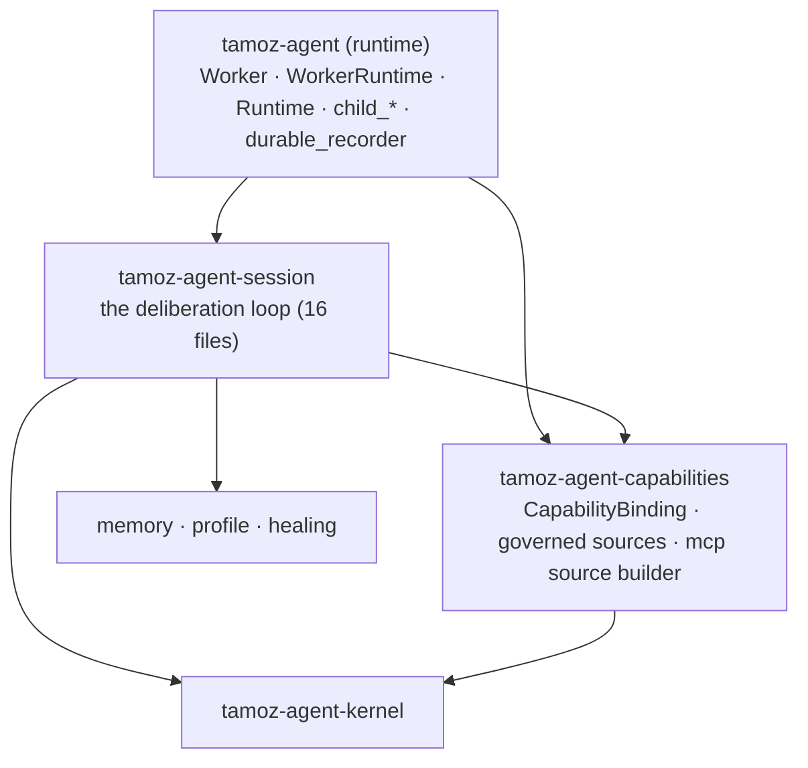

# Can we extract a `session` gem — and what else is left in `tamoz-agent`?

A fresh look, requested after the six-gem decomposition landed
(`docs/agent-gem-decomposition-2026-08-23`). That study **explicitly deferred**
the session split as "lower-value, higher-risk … shares the durable record and
thread-advance machinery tightly" (01 ~line 217; 08 §4). This re-examination
tests that claim against the current tree instead of inheriting it — and the
claim does not survive contact with the code.

**Bottom line:** a session gem is viable and cleaner than the prior study
assumed. There is also a *second* clean extraction sitting underneath it (the
capability/sources bridge, the old 04-F). I recommend both, session on top of
capabilities, in that order.

---

## 1. The coupling claim, tested

### Direction of dependency is one-way, not mutual

The prior study's risk rests on session and worker being mutually entangled.
They are not. The edges only point one way:

| Edge | Evidence | Strength |
|---|---|---|
| Worker → Session | `worker_runtime.rb:1044,1061` (`Session.new`), `worker.rb:254,449,472,556,1152,1158` | Worker **constructs and drives** Session |
| Runtime → Session | `runtime.rb:753,786` (`SessionRecords.digest`) | ephemeral driver reaches one helper |
| Session → Runtime | `session.rb:69,100`, `session_nodes.rb:24-25` | **constants only** (`MAX_TASK_BYTES`, `MAX_OBSERVATION_BYTES`, `MAX_REPAIR_ATTEMPTS`) |

Session does **not** reference `Worker` or `WorkerRuntime` anywhere. The only
thing pointing *up* from Session into the driver layer is three integer
constants that happen to live on `Runtime` — and that's an inversion to fix, not
a coupling to fear (§4).

### Worker drives Session through a narrow facade

Everything Worker needs is public method surface (from enola's symbol list):
`start` · `resume` · `continue` · `recover` · `view` · `effect` · `model` ·
`app.durable_runner` · `capabilities` · `outcome`. No file in the worker family
reaches into `SessionRecords`, `SessionSteps`, `SessionEffects`, or any other
`session_*` internal — verified by grep. The one internal reach-in to
`SessionRecords.digest` comes from `Runtime` (the *ephemeral* driver), not the
durable worker.

### Blast radius is small and mostly tests

enola `impact_analysis(Tamoz::Agent::Session)` → **28 dependents at depth 1, of
which 20 are tests.** Non-test dependents: 3 symbols inside
`gems/tamoz-agent/lib/tamoz/agent` (Worker, WorkerRuntime, Runtime), 3 in the
evals harness, 2 in `script/`. The genuine architectural pinch-point in this
neighbourhood is `Deliberation` (fan-in 20) — and that **already lives in
`tamoz-agent-kernel`**. Session is not itself a hotspot.

> The "31-module coupling cluster" the prior study worried about is the
> `session_*` files cohering **among themselves** (16 files that all move
> together — exactly what you want in one gem), not session tangled into worker.

---

## 2. What a `session` gem would contain

The 16 `session*.rb` files — **~5,043 lines**, already one cohesive family:

```
session.rb (789)  session_records.rb (551)  session_planning_context.rb (544)
session_adaptive.rb (520)  session_effects.rb (343)  session_steps.rb (323)
session_routing.rb (302)  session_plan_attempt.rb (255)  session_nodes.rb (224)
session_evidence.rb (221)  session_plan_outcomes.rb (189)  session_lifecycle.rb (187)
session_bindings.rb (172)  session_status_projection.rb (153)
session_deliberation.rb (136)  session_memory.rb (134)
```

**Namespace:** `Tamoz::Agent::Session*` (Option-B, unchanged — matches the six
prior gems).

**Depends on (all downward):** `tamoz-agent-kernel` (`Deliberation` ×30,
`EffectDispatcher`, `Plan`), `tamoz-agent-memory`, `tamoz-agent-profile`,
`tamoz-agent-healing`, `tamoz-core`, and the **capability/sources cluster**
(§3, via `CapabilityBinding.build` at `session_nodes.rb:103`).

**Does NOT depend on** (verified — the apparent hits are all comments):
`tamoz-graph`, `tamoz-comms`, `tamoz-approval`, `tamoz-mcp` internals. Session
is duck-typed on its injected `model`, `toolbox`, and `mcp` source — "the source
is duck-typed, and every MCP-specific behaviour is its own method"
(`session.rb:174`). This is the single most important finding: **session is
transport/driver-agnostic by construction**, which is what makes it extractable
below both Worker (durable) and Runtime (ephemeral).

**Public surface to freeze during the move:** the ~10 facade methods in §1 plus
`ROUTINGS`, `MODEL_CALL_SAFETIES`, `GRAPH_NAME`, `build_definition`, and
`SessionRecords.digest` (promoted to public because `Runtime` calls it).

> **Correction (after checking the CLI gem).** The first pass generalized "narrow
> facade" from Worker/Runtime alone. The **CLI is a third driver and reaches
> wider**: it names three session-family internals directly —
> `SessionStatusProjection` (`.document`/`::SCHEMA`, used across `cli_rendering`
> and `cli_worker_commands`), `SessionPlanningContext.follow_up_payload`
> (`cli_session_commands`), and `SessionRecords::LEGACY_PROFILE_ID`
> (`cli_authority`, `cli_profile_commands`) — plus `Session#verify_skill_binding!`
> and `Session#resolve_effect`. These are all legitimately Session's public
> surface (the CLI is a normal top-of-stack consumer), so the extraction still
> holds — but the frozen surface is larger and the move adds a
> `tamoz-agent-cli → tamoz-agent-session` gemspec edge. Full list and wiring in
> [PLAN.md](PLAN.md) Phase PB.

---

## 3. The second gem hiding underneath: capability/sources bridge (old 04-F)

Session sits on a capability layer that is itself a clean cut — the study's
never-scheduled **04-F** (08 §4, "medium confidence, still open"). This
re-scan raises the confidence: it is the thing session binds to.

**Contents (~1,205 lines):**
```
capability_binding.rb (402)       mcp_source_builder.rb (276)
mcp_capability_source.rb (263)    governed_browser_source.rb (168)
governed_database_source.rb (96)
```

`CapabilityBinding.build(toolbox:, mcp:, child_task_runtime:, profile:)` is the
join point — constructed from `session_nodes.rb:103`, `runtime.rb`,
`worker_runtime.rb`, and `mcp_source_builder.rb`. It binds the governed sources
(browser, database, MCP) into the capability surface a session runs against.

**Namespace:** `Tamoz::Agent` (these are already top-level `Tamoz::Agent::*`).
**Depends on:** `tamoz-agent-kernel`, `tamoz-mcp`, `tamoz-core`,
`tamoz-agent-profile`. **Does not depend on** session or worker.

Extracting this *first* gives session a clean gem to depend on instead of
reaching sideways into ungrouped runtime files. Skipping it means the session
gem swallows these five files too — workable, but it muddies "session = the
deliberation loop."

---

## 4. Resulting topology



`tamoz-agent` shrinks to the **drivers**: durable execution (Worker,
WorkerRuntime), ephemeral execution (Runtime), child-task machinery
(`child_task*`, `child_environments`), delivery/recording (`durable_recorder`,
`request_*`, `lane_config`, `terminal_progress`, `episode_graph`), and
`agent.rb`'s build entry points. It keeps its `tamoz-graph` / `tamoz-comms` /
`tamoz-approval` edges — session and capabilities do not inherit them.

**The one inversion to fix on the way:** `MAX_TASK_BYTES`,
`MAX_OBSERVATION_BYTES`, `MAX_REPAIR_ATTEMPTS` currently live on `Runtime` (a
driver) but are consumed by `Session` (a lower layer). Move them **down** onto
Session (or kernel) so the arrow points the right way; `Runtime` then reads them
from below like everyone else. This is the only source change the move *requires*
— everything else is file relocation + require rewiring.

---

## 5. Honest counter-arguments

- **`SessionRecords.load!` complexity 21** (enola). It's the durable-record
  decoder and the most-branched symbol in the family. Per the study's two-stage
  rule (03), move it verbatim in Stage A, then simplify in Stage B of the *same*
  phase — the phase isn't done while it's still flagged.
- **Runtime ⇄ Session share `SessionRecords`.** Runtime (ephemeral) genuinely
  uses `SessionRecords.digest`. Resolved by making that one method public API of
  the session gem; it does not force Runtime to move.
- **Value vs. the six that shipped.** Lower than kernel/memory (those had
  external consumers already naming them across gem boundaries). Session's
  consumers are Worker, Runtime, the eval harness, and tests. The win here is
  *shrinking the runtime god-gem* (~11,700 → ~5,400 lines) and making "the
  deliberation loop" a nameable, independently-testable unit — not new external
  reuse. Worth doing; not urgent.
- **The study said no.** It did — but on a coupling premise this scan shows is
  inaccurate. Recording the correction is the point of this doc.

---

## 6. Recommendation

1. **Extract `tamoz-agent-capabilities` first** (04-F, ~1,205 lines). Low risk,
   no session/worker deps, gives session something clean to stand on.
2. **Then `tamoz-agent-session`** (~5,043 lines), fixing the Runtime-constant
   inversion as part of Stage A.
3. Leave Worker/Runtime/child/delivery as `tamoz-agent` — that split (durable vs.
   ephemeral drivers) is real but the two share the child-task and durable-record
   machinery, and *that* is where the tight coupling actually is. Not now.

**Before touching anything**, honour `enola.md`: the snapshot is currently stale
(commit moved since the merge). `generate_snapshot` → `set_baseline` on merged
`main`, run `impact_analysis` on `Session`, `CapabilityBinding`, and `Runtime`,
then `diff_snapshot` after each stage. Watch specifically for a new
`tamoz-agent ↔ tamoz-agent-session` cycle if any driver constant is left
pointing the wrong way (§4).

I'd want your call on **scope** before drafting a phased plan: capabilities +
session both, session only, or park it. See the question I'm posing alongside
this doc.

---

## Appendix — evidence index

| Claim | Evidence |
|---|---|
| Worker constructs/drives Session | `worker_runtime.rb:1044,1061`; `worker.rb:254,449,472,556,1152` |
| Session→Runtime is constants only | `session.rb:69,100`; `session_nodes.rb:24-25`; `runtime.rb:27-29` |
| Session is duck-typed on model/mcp | `session.rb:174` |
| Session has no graph/comms/approval hard dep | grep: only comment hits in `session*.rb` |
| CapabilityBinding is the join point | `session_nodes.rb:103`; constructed in runtime/worker_runtime/mcp_source_builder |
| Blast radius 28 (20 tests) | enola `impact_analysis(Tamoz::Agent::Session)` |
| Deliberation is the real hotspot (in kernel) | enola insight: fan-in 20 |
| SessionRecords.load! complexity 21 | enola insight |
