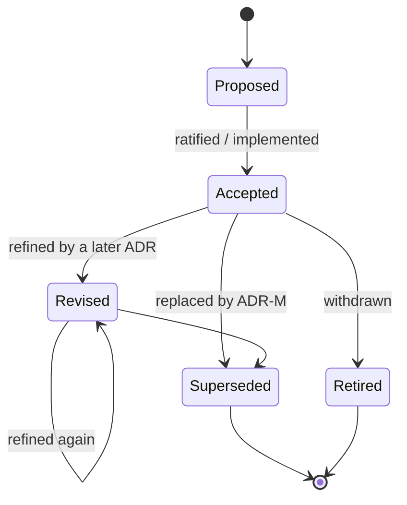

# ADR lifecycle

How a Tamoz decision moves through states, and the mechanical steps at each transition. The
status vocabulary and grading rubric live in [`ADR_QUALITY_BAR.md`](./ADR_QUALITY_BAR.md); this
page is the workflow that goes with them.

## States

- **Proposed** — decided in a design but not yet ratified or implemented. Must name what would
  ratify it.
- **Accepted** — in force. An implemented Accepted ADR carries a `## Verification` line.
- **Revised** — still in force, but changed after review or a counterexample. Says *what*
  changed (usually via a later ADR named in its Status).
- **Superseded by ADR-M** — no longer in force; ADR-M lists the ADR it replaced. Becomes a
  tombstone stub + a row in [`RETIRED.md`](./RETIRED.md).
- **Retired** — withdrawn, and nothing replaces it. Same tombstone + ledger treatment.

## Authoring a new decision

1. **Number** = `catalog.json`'s `next_number` (shown at the bottom of the README index).
   Numbers are never reused.
2. **Copy** [`_TEMPLATE.md`](./_TEMPLATE.md) to `adr-<NNN>-<slug>.md`. The title is a *claim*;
   fill the sections to the ADR's tier.
3. **Index** it: add one row to the README's ADR index.
4. **Check**: `rake adr:catalog` then `rake adr:validate adr:verify`. Green means it meets the
   bar (structure, links, numbering, and every Verification citation resolves).
5. *(Optional)* refresh the derived views: `rake adr:trace` and `rake adr:graph`.

## Retiring or superseding a decision

1. In the **successor**, name the ADR it replaces in its **Relates to** / **Status**.
2. Reduce the old ADR to a **tombstone stub** — see [`adr-002`](./adr-002-four-v0-1-runtime-gems.md)
   for the shape — and add a row to [`RETIRED.md`](./RETIRED.md).
3. Update the old ADR's README row (status → `Retired → NNN`, link → the tombstone), then
   `rake adr:catalog` (and `adr:graph` to refresh the edges).
4. `rake adr:validate` enforces the result: every number still resolves to a file, and every
   retired ADR names a successor and has a `RETIRED.md` row.

## Next reads

- [`ADR_QUALITY_BAR.md`](./ADR_QUALITY_BAR.md) — the rubric and the section template
- [`_TEMPLATE.md`](./_TEMPLATE.md) — the copyable skeleton
- [`README.md`](./README.md) — the catalog and the tooling commands
