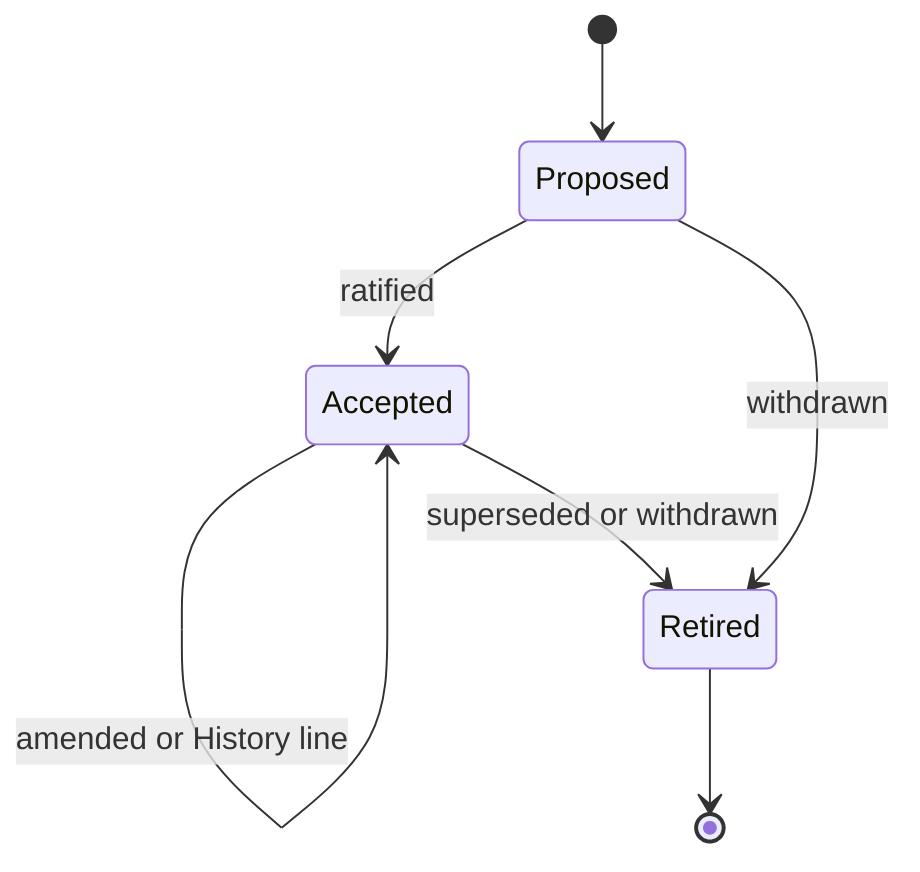

# ADR lifecycle

How a decision moves through its states. The rubric is [`ADR_QUALITY_BAR.md`](./ADR_QUALITY_BAR.md).

## States

- **Proposed** — decided in a design, not ratified or built. Names what would ratify it.
- **Accepted** — in force. `Implementation:` says whether it is Complete, Partial (with the gap),
  or Not built.
- **Retired** — no longer in force: superseded by a named ADR, or withdrawn with nothing in its
  place. The file becomes a tombstone and `RETIRED.md` gets a row.

A decision that stays in force but changes is not a new state. Either a later ADR **amends** it
(both files carry the edge: `Amends:` / `Amended by:`), or the ADR itself gets a dated **History**
line plus the rewritten rule. Loosening an authority boundary always takes a History line naming
who decided, and a revised threat model.

```mermaid
stateDiagram-v2
  [*] --> Proposed
  Proposed --> Accepted: ratified
  Accepted --> Accepted: amended or History line
  Accepted --> Retired: superseded or withdrawn
  Proposed --> Retired: withdrawn
  Retired --> [*]
```

## Author a decision

1. Take the number from `catalog.json` `next_number`. Numbers are never reused.
2. Copy [`_TEMPLATE.md`](./_TEMPLATE.md) to `adr-<NNN>-<slug>.md` and fill it to its tier.
3. Add one row to the README index under its area.
4. `rake adr:catalog adr:validate adr:verify` — structure, metadata, links, reciprocity, cited
   paths. Green means the mechanical checks pass, nothing more.
5. Have someone other than the author do the semantic review (bar §7) and record it.
6. Refresh the derived views: `rake adr:trace adr:graph`.

## Amend a decision

1. Rewrite the rule where it lives; present tense must match the code after the change.
2. Add a History line: date, what changed, who decided, why.
3. If a different ADR causes the change, add `Amends:` to it and `Amended by:` to this one.
4. Update every consumer of the rule (designs, guides, tests that pin the prose) in the same
   change.

## Retire or merge a decision

1. The surviving ADR absorbs whatever rule and evidence still hold, and names the retired one in
   its `Supersedes:` header.
2. Move the old file into `retired/`, update its incoming and relative links, and shrink it to a tombstone: Status `Retired YYYY-MM-DD — superseded by ADR-M`, with
   ADR-M linked (or `— withdrawn`), one paragraph of what it said, and where it went.
3. Add a row to [`RETIRED.md`](./RETIRED.md) and move its README row to the Retired table.
4. `rake adr:catalog adr:validate adr:graph`.

## Next reads

- [`ADR_QUALITY_BAR.md`](./ADR_QUALITY_BAR.md) — the rubric
- [`README.md`](./README.md) — the catalog and tooling commands
