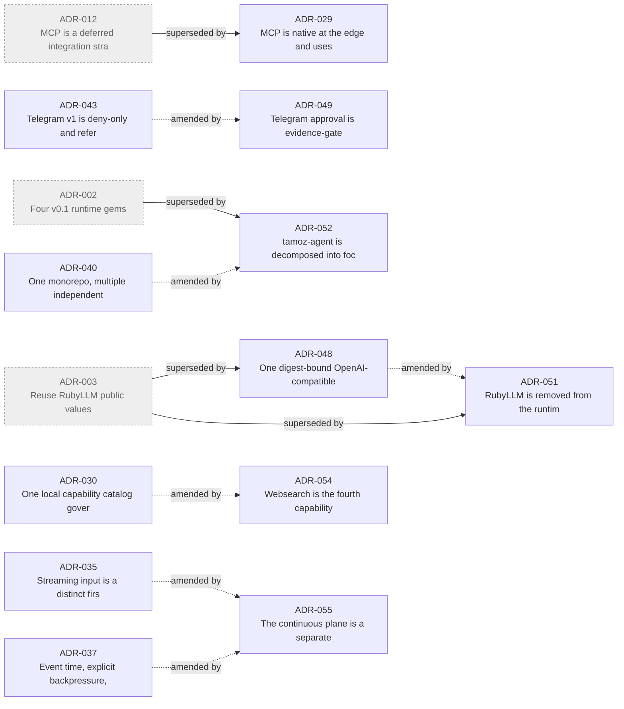

# ADR relationships

Supersession and amendment edges between ADRs, generated from
[`catalog.json`](./catalog.json) by `script/adr_graph.rb` (`rake adr:graph`). An arrow
points from a decision to the ADR that replaced or amended it. Retired decisions are
marked; everything not shown here stands on its own.

Solid = superseded (no longer in force). Dashed = amended/extended/revised (still in
force, refined by a later ADR). Full history: [`RETIRED.md`](./RETIRED.md).

## Next reads

- [`README.md`](./README.md) — the ADR catalog and its amendment-chain list
- [`catalog.json`](./catalog.json) — the machine-readable edges
