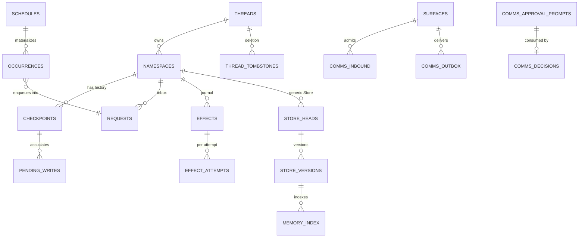

# Data model

Tamoz persists durable state in a single SQLite database per runtime or session location: checkpoints, the request inbox, the effect journal, leases, schedules, the comms store, the circuit store, and the memory index. This page describes what each store holds and the migration regime that keeps the schema honest.

Current version: `0.1.0.alpha.1` (pre-release). Schema `CURRENT_VERSION = 13`.

## One database, many stores

## The core stores

### Checkpoints and leases

- **`tamoz_threads` / `tamoz_namespaces`** — one row per thread; per-namespace state including the active checkpoint, the strict monotonic `next_checkpoint_sequence`, and the lease (`lease_owner_id`, `lease_fence`, `lease_expires_at_ms`). Exactly one renewable lease advances a `(thread_id, namespace)`; every durable write rejects an expired or stale fence (invariant 20).
- **`tamoz_checkpoints`** — append-only checkpoint history. Each row records `execution_id`, strict `sequence`, `parent_id`, `format_version`, `graph_name`/`graph_version`, `digest_version`, `definition_digest`, `fence`, status, and the JCS-canonical payload plus its digest. Resume fails before user code if versions or digests are incompatible; migrations produce a new checkpoint, history is never mutated.
- **`tamoz_pending_activations` / `tamoz_pending_writes`** — task results and channel writes awaiting the next barrier, keyed by execution and task identity with per-attempt ids.

### Request inbox

- **`tamoz_requests`** — the durable queue. Enqueue deduplicates before lease acquisition, allocates backend order (`enqueue_sequence`), and persists payload digest and delivery mode. Claim-next is fenced FIFO; redirect records target/cancellation once and reconciles in-flight effects (invariant 53).
- **`tamoz_request_transitions`** — the durable transition history for every request.

### Effect journal

- **`tamoz_effects`** — one row per effect key `(thread_id, ns, execution_id, logical_activation_id, call_index, operation)`, carrying the safety class (`read_only`, `idempotent`, `transactional`, `reconcilable`, `unsafe`) and the durable status machine (`prepared`, `running`, `succeeded`, `failed`, `unknown`, `reconcile`, `abandoned`).
- **`tamoz_effect_attempts`** — per-attempt records with unique attempt tokens and fences; a stale graph owner may record only its own attempt's truthful outcome.
- **`tamoz_effect_transitions`** — the durable audit trail of every transition, actor, and evidence blob.

### Generic Store, circuits, memory

- **`tamoz_store_heads` / `tamoz_store_versions`** — the versioned cross-thread Store. The DR-2 circuit store lives here: each circuit scope type maps to namespace `tamoz.circuit.<scope_type>` and key `<scope_digest>` for the four scopes (`server`, `rule_target`, `schedule`, `egress`). Memory records also live here, with per-version rows.
- **`tamoz_memory_index`** — the lexical index over memory versions: layer (`experience`/`knowledge`/`wisdom`), class, state, tenant/user/project scope, sensitivity, validity, graph/behavior compatibility, and a searchable statement column that is populated only for non-sensitive records (invariant 30). `MIGRATION_12` adds situation/entity scope columns.

### Scheduling

- **`tamoz_schedules`** — one row per schedule revision (CAS on `expected_revision`), each with its definition digest and payload digest.
- **`tamoz_occurrences`** — the closed occurrence state machine (`due → claimed → enqueued → running → succeeded|failed|cancelled|unknown`, plus `skipped|coalesced`) with durable fence/owner. The `request_id UNIQUE` constraint is the dedup seam: a retried delivery re-enqueues the same request row (invariant 38).

### Comms store

- **`tamoz_comms_surfaces` / `tamoz_comms_bindings`** — configured channel surfaces and their conversation bindings.
- **`tamoz_comms_inbound` / `tamoz_comms_requests` / `tamoz_comms_poll_state`** — durable admission of inbound messages and the poll offset (persisted only after durable disposition of the returned prefix).
- **`tamoz_comms_outbox`** — the bounded durable outbox drained under a fenced lease; an ambiguous non-idempotent send becomes `:unknown` with no automatic retry (invariant 57).
- **`tamoz_comms_approval_prompts` / `tamoz_comms_decisions`** — single-use expiring approval references (digest-only) and their consumed decisions; `MIGRATION_9`/`MIGRATION_10` pin `required_evidence` and the decision audit trail (ADR-049).
- **`tamoz_comms_gaps` / `tamoz_comms_delivery_pacing`** — detected gaps and durable delivery pacing.

### Deletion

- **`tamoz_thread_tombstones` / `tamoz_deletion_receipts`** — thread deletion first tombstones new work; live leases and unresolved effects block purge unless each effect has a separately authorized recorded resolution; the final purge emits a complete deletion receipt (invariant 54).

## Migration regime

The schema moves forward through **13 checksummed, monotonic migrations**:

- Each ordinal `1..13` maps to a frozen statement list and its SHA-256 checksum. The monotonic-ordering test asserts the ordinals are exactly `1..CURRENT_VERSION` with no gap and no reuse.
- `PRAGMA application_id` is `0x54414D5A` ("TAMZ"); a database belonging to another application is refused. `PRAGMA user_version` must equal `CURRENT_VERSION`; a newer schema fails fast.
- Migrations apply in one transaction; a failure rolls back every statement, so a fresh database and an in-place upgrade are both all-or-nothing.
- Every existing ordinal must still be recorded with its registered checksum before pending ones are layered on. The digest epoch (`DIGEST_EPOCH = 1`, registered by `MIGRATION_11`) guards the canonical serialization rule.
- **No backwards compatibility**: databases are free to be reset or cleaned whenever a change needs it. `MIGRATION_13` drops the retired P14 streaming-engine tables outright.

SQLite serializes writers even in WAL mode, so `tamoz-sqlite` keeps write transactions short, uses `BEGIN IMMEDIATE` where appropriate, retries `SQLITE_BUSY` with bounded jitter, and never holds a transaction across a model or tool call. Backup and restore are adapter-level operations ([../operations/operations.md](../operations/operations.md)).

## Next reads

- [overview.md](overview.md) — the runtime model above this store
- [invariants.md](invariants.md) — clauses 16–24, 38–40, 53–54 in detail
- [../operations/operations.md](../operations/operations.md) — backup, restore, crash recovery
- [../design/graph.md](../design/graph.md) — the checkpoint/lease/effect contracts from the design side
