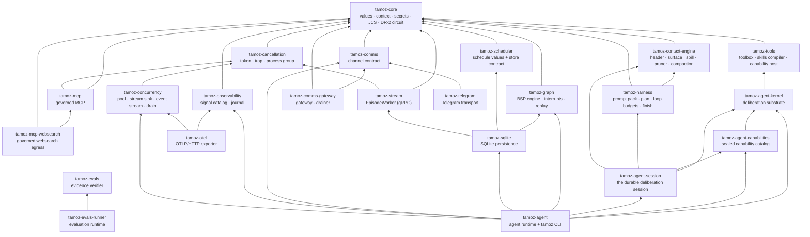

# Gem map

Tamoz is a monorepo of twenty-seven independently publishable gems, all at `0.1.0.alpha.1` (pre-release), MIT-licensed, and pinned to `required_ruby_version >= 3.3 < 5.0`. This page maps each gem's responsibility, its runtime dependencies, and the bottom-up dependency chain.

## The dependency chain

Dependencies run one way, bottom-up: everything eventually rests on `tamoz-core`;
the evaluation gems are development/release companions and are not product-runtime dependencies.

Two edges deserve emphasis:

- **`tamoz-agent-kernel` owns the model transport boundary.** It validates the provider matrix, resolves credentials inside `ModelClientFactory`, and constructs `EpisodeModelTransport`. Sibling gems use the injected model protocol or the factory seam; no provider SDK dependency is declared.
- **Nothing in the product runtime depends on the evaluation gems.** `tamoz-evals` verifies artifacts and `tamoz-evals-runner` executes explicitly supplied evaluation inputs; both are development/release companions. `test/dependency_isolation_test.rb` enforces that one-way boundary.

## The gem-by-gem map

| Gem | Responsibility | Runtime dependencies |
|---|---|---|
| `tamoz-core` | Shared values, context, secrets, canonical/JCS digesting, the worker pool, and the DR-2 durable-circuit engine | stdlib, Zeitwerk |
| `tamoz-cancellation` | Cancellation token, signal traps, process-group primitives, interruptible sleep | `tamoz-core` |
| `tamoz-concurrency` | Bounded pools, stream sink, event stream, shared-budget drain base class | `tamoz-cancellation`, `tamoz-core` |
| `tamoz-graph` | Deterministic checkpointed graph runtime: BSP super-steps, interrupts, replay, subgraphs, durable-runner contracts. Never loads an LLM client (invariant 11) | `tamoz-cancellation`, `tamoz-concurrency`, `tamoz-core`, Zeitwerk |
| `tamoz-scheduler` | Durable scheduling values and the `ScheduleStore` contract (the SQLite implementation lives in `tamoz-sqlite`). Never executes work itself | `tamoz-core` |
| `tamoz-stream` | The supervised gRPC `EpisodeWorker`: containment host, snapshot verification, typed Decision builder, reverse channel for evidence/outcomes/approvals, artifact manifest. One sealed, digest-verified Situation snapshot per episode (the old streaming-input engine was retired by `MIGRATION_13`) | `tamoz-core`, `grpc ~> 1.83`, `google-protobuf ~> 4.35` |
| `tamoz-sqlite` | SQLite persistence: checkpoints, request inbox, effect journal, leases, schedules, comms, circuit, memory index, backup/restore. Migrator `CURRENT_VERSION = 13` | `tamoz-graph`, `tamoz-scheduler`, `tamoz-stream`, `sqlite3 ~> 2.9` |
| `tamoz-tools` | Workspace toolbox, the skills compiler, and the sealed capability host | `tamoz-core` |
| `tamoz-context-engine` | Context-window management for agent loops: frozen request header and request series, append-only surface, spill, pruner, compaction, token meter, cache accounting, trace | `tamoz-core` |
| `tamoz-harness` | The coding-harness protocol: digest-pinned prompt pack, persona and preferences, project guidance, living plan, tool-call parsing, loop budgets and repeat guard, finish contract, handoff | `tamoz-context-engine`, `tamoz-core` |
| `tamoz-mcp` | Governed MCP client/host over the official Ruby SDK | `tamoz-core`, `tamoz-cancellation`, `mcp ~> 1.1` |
| `tamoz-mcp-websearch` | Governed operator-side websearch egress adapter; preserves `Tamoz::Mcp::Websearch` | `tamoz-mcp`, `tamoz-core` |
| `tamoz-comms` | Channel contract gem: values, identity/admission policy, rendering, the `Transport` seam, and the structural `CommsStore` contract. Never opens a socket | `tamoz-core` |
| `tamoz-comms-gateway` | Long-running `Gateway` and `DeliveryDrainer` process boundary over caller-injected transport, store, checkpoint, control, and effect-binding seams | `tamoz-comms`, `tamoz-core` |
| `tamoz-approval` | Policy-as-data approval engine: requests, decisions, grants, policy documents, and durable decision log | `tamoz-core` |
| `tamoz-observability` | Closed versioned signal catalog, correlation identity, immutable signals, bounded recorders, local journal, content/secret policy, metrics and trace projection. `SCHEMA_VERSION = 1` | `tamoz-core` |
| `tamoz-otel` | Bounded OTLP/HTTP exporter for observability signals | `tamoz-observability` |
| `tamoz-telegram` | Telegram Bot API transport implementing the `Tamoz::Comms::Transport` seam; stdlib-only HTTP | `tamoz-comms` |
| `tamoz-agent-kernel` | The deliberation substrate: episode records/receipts, reasoning documents, the plan/review/execute/verify engine, `EffectDispatcher`, witness gateway/verifier, catalogs, the agent error taxonomy, and the provider/env-key catalog | `tamoz-core`, `tamoz-tools` |
| `tamoz-agent-capabilities` | Sealed capability catalog over toolbox, skills, MCP, browser, and database sources | `tamoz-agent-kernel`, `tamoz-core`, `tamoz-mcp`, `tamoz-tools` |
| `tamoz-agent-memory` | Durable memory: `Memory::Engine` assembling admission, retrieval, lifecycle (deletion with receipts), consolidation into wisdom, behavior transitions | `tamoz-agent-kernel`, `tamoz-core`, `tamoz-sqlite`, `tamoz-tools` |
| `tamoz-agent-healing` | Bounded self-healing: typed failure contract, classification with abstention, immutable digest-bound rules, reviewed remediation protocol, promotion gate | `tamoz-agent-kernel`, `tamoz-core`, `tamoz-tools` |
| `tamoz-agent-profile` | Trusted profiles: document/authority/egress/check-spec validators, secure files, adoption and transition registries | `tamoz-agent-kernel`, `tamoz-core` |
| `tamoz-agent-session` | Durable deliberation session: versioned records, planning context, graph nodes, effects, routing, adaptive machinery, and the coding work loop | `tamoz-agent-kernel`, `tamoz-agent-capabilities`, `tamoz-agent-memory`, `tamoz-agent-profile`, `tamoz-agent-healing`, `tamoz-harness`, `tamoz-context-engine`, `tamoz-cancellation`, `tamoz-core`, `tamoz-graph`, `tamoz-tools` |
| `tamoz-agent-improvement` | Bounded self-improvement: candidate provenance, heuristic generator, paired evaluation reports, human-gated promotion/rollback | `tamoz-agent-kernel`, `tamoz-agent-memory` |
| `tamoz-agent-cli` | The `tamoz` executable: worker/schedule/profile/session/comms command groups over the runtime; the family's only executable | `tamoz-agent`, `tamoz-comms-gateway` |
| `tamoz-agent` | The deliberative agent runtime as a library: session state machine over the graph, worker/durable execution, capability and transport wiring | `tamoz-agent-kernel`, `tamoz-agent-memory`, `tamoz-agent-healing`, `tamoz-agent-profile`, `tamoz-agent-improvement`, `tamoz-tools`, `tamoz-graph`, `tamoz-sqlite`, `tamoz-comms`, `tamoz-approval`, `tamoz-observability` |
| `tamoz-evals` | Artifact schemas, canonical JSON, evidence values, verifier decisions and release evidence. Development/release gem; nothing depends on it | `tamoz-core` |
| `tamoz-evals-runner` | Evaluation harnesses, scorecards, treatments and benchmarks. Inputs are caller-owned and supplied through an explicit manifest or adapter | `tamoz-evals`, selected runtime gems |

## Dependency rules that are enforced, not suggested

- `tamoz-core` has no runtime dependency beyond the standard library and Zeitwerk.
- `tamoz-graph` never references a model transport, an HTTP client, a provider SDK, or an adapter — a clean process requiring `tamoz/graph` loads none of them and opens no socket.
- Graph nodes never call a model or transport directly: they receive journaled call objects, and every model execution crosses `EffectDispatcher.run` behind the doors enforced by `test/model_call_node_contract_test.rb` (`SessionEffects#model_call`, `Memory::Consolidation`, `Runtime#model_generate`, and `DeferredModel` forwarding behind SessionEffects' perform block). Model lifecycle events stay runner-emitted.
- Adapters implement published contracts and depend on contracts, never on runner internals.
- Optional dependencies load only when their feature is selected. Fiber execution, OTLP export, and Telegram transport must not affect a minimal boot.
- No mutable process-global runtime state: boot-time registries freeze after configuration; per-run state travels through `Context`; per-thread durable state travels through the checkpointer.
- Optional persistence protocols (schedule, stream, comms) are structural and versioned: the feature gem owns the contract documentation; `tamoz-sqlite` implements it without a reverse runtime dependency.

## Next reads

- [overview.md](overview.md) — the layered stack these gems form
- [../overview/compatibility.md](../overview/compatibility.md) — versions and supported surfaces
- [data-model.md](data-model.md) — what `tamoz-sqlite` persists
- [../getting-started/install.md](../getting-started/install.md) — installing the gems
