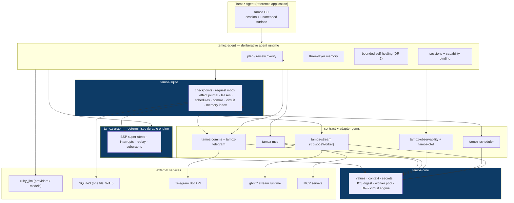

# Architecture overview

This page describes the layered stack of Tamoz, the runtime model that connects the layers, and the two load-bearing rules every other guarantee rests on. For the per-gem map see [gems.md](gems.md); for persistence details see [data-model.md](data-model.md).

Current version: `0.1.0.alpha.1` (pre-release).

## The layered stack



Direction of production dependency is one-way and bottom-up: `tamoz-core` → contract gems and `tamoz-graph` → `tamoz-sqlite` and the adapters → `tamoz-agent`. Nothing may depend on `tamoz-evals`; it is a development/release gem that depends on the runtime gems it exercises (core, agent, sqlite, mcp, graph, scheduler) and that no production gem may depend on.

## The runtime model

One execution protocol runs the whole stack:

```ruby
step.call(input, context)
```

A graph node receives frozen state as `input` and returns a partial update or a `Command`. A compiled graph implements the same protocol, so it can be nested as a subgraph. State handed to nodes is copied, normalized, and recursively frozen at commit; unsupported mutable objects fail before execution.

Execution is a coordinator-driven loop:

1. The coordinator plans a super-step from one committed checkpoint.
2. Each task runs inside its own worker boundary with a worker-local `catch(:tamoz_interrupt)`.
3. Successful task writes are durably appended.
4. One next checkpoint is committed atomically — but only if the base checkpoint and the fencing token still match.

A durable graph returns from a barrier only after its checkpoint commits (ADR-015). One renewable lease advances a `(thread_id, namespace)` pair; a stale owner can finish a remote call but cannot commit state after losing ownership.

### Two load-bearing rules

1. **`tamoz-graph` never loads an LLM client.** Requiring `tamoz/graph` in a clean process loads no RubyLLM, no HTTP client, no provider, and no adapter — and opens no socket (invariant 11). The graph engine is a general durable-execution runtime: testable offline, and reusable for durable workflows that have nothing to do with language models.
2. **Checkpoints make state durable, not external effects exactly-once.** Every side effect has a stable key, a safety class, and an attempt token (invariant 21). Idempotent or reconcilable effects may converge; an ambiguous non-idempotent effect becomes `:unknown` and requires human reconciliation. It is never retried blindly.

Everything else — reviewed plans, approvals, verification, healing — is policy layered on top of these two facts.

## The execution boundary

The contracts stay separate because they have different failure semantics:

| Contract | Essential operation |
|---|---|
| Checkpointer | load, append task writes, compare-and-append a checkpoint |
| Lease | acquire, renew, release with a fencing token |
| Effect journal | prepare with an attempt token, complete/reconcile an external effect |
| Request ledger | claim and complete a surface input by stable request id |
| Schedule/occurrence store | revise schedules, claim due occurrences, enqueue stable requests |
| Comms store | durable admission, outbox, decisions, approval prompts |
| Store | explicit cross-thread application data (circuits, memory records) |
| Notifier | observe an event without influencing behavior |
| Stream sink | deliver a behaviorally relevant event with backpressure |

## What each layer owns

- **`tamoz-core`** — values and dispatch shared across boundaries: context, secrets, the worker pool, canonical/JCS digesting, and the DR-2 circuit engine. It owns no graph state and no persistence.
- **`tamoz-graph`** — deterministic execution semantics: definition digest, state schema, reducers, super-steps, deterministic task identity, checkpoint/lease/store contracts, interrupt/resume, replay, fork, subgraphs. It guarantees atomic committed state; it does not claim exactly-once external effects.
- **`tamoz-sqlite`** — one production adapter: append-only checkpoints, atomic compare-and-append commit, fenced leases, the effect journal, the request inbox, schedules, the comms store, circuits and the memory index, plus backup/restore and 13 checksummed migrations.
- **`tamoz-agent`** — recipes over the graph: the durable model↔tools loop, RubyLLM binding, approval, effect classification, plan/review/verify gates, memory, healing, and the CLI.
- **Contract gems** — `tamoz-comms` (channels), `tamoz-observability` (signals), `tamoz-scheduler` (durable time), `tamoz-stream` (the episode worker), `tamoz-mcp` (governed MCP + websearch), each with a structural store contract implemented by `tamoz-sqlite`.
- **Adapter gems** — `tamoz-telegram` (transport), `tamoz-otel` (export). Neither is required for a minimal boot.

## Next reads

- [gems.md](gems.md) — the 13-gem map and dependency chain
- [data-model.md](data-model.md) — checkpoints, inbox, effects, leases in SQLite
- [security-model.md](security-model.md) — the authority boundary
- [../design/README.md](../design/README.md) — the design documents behind this stack
- [../overview/concepts.md](../overview/concepts.md) — the mental model in one page
