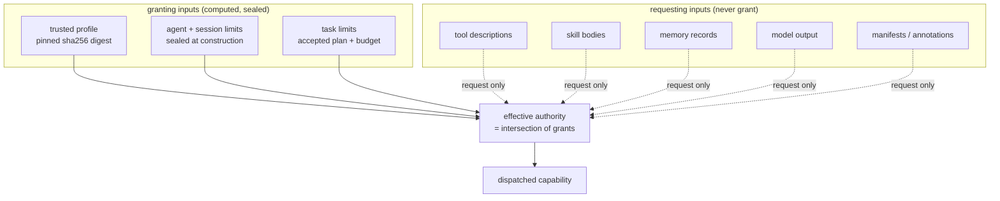

# Security model

Tamoz is an operational agent: it reads a workspace, proposes reviewed plans, and — when explicitly enabled — edits files and runs configured checks. This page states the security boundary that constrains it. The authoritative policy lives in [../../SECURITY.md](../../SECURITY.md) and the executable clauses in [invariants.md](invariants.md).

Current version: `0.1.0.alpha.1` (pre-release). This is pre-release software and must not yet control production systems or physical devices.

## Authority is local, intersected, content-addressed

A capability's effective authority is the **intersection** of the current profile, the agent's limits, and the task's limits. Descriptions, annotations, manifests, skill bodies, memory records, and model output can *request* capability; none of them can grant one or lower a risk class.

The capability registry is a **closed set of four built-in sources** — local tools, skills, MCP servers, and websearch — sealed at session construction. A forged or caller-supplied source is refused at construction, not at dispatch.

## Nothing acts without a reviewed plan

Every new user, scheduled, delegated, or internally generated task persists a versioned plan and an accepted review bound to its canonical digest before capabilities run (invariant 25). No file changes without an approval granted for that exact diff: a mutation between approval and dispatch is refused, not reconciled (invariant 26). Insufficient evidence produces a reviewed, read-only discovery plan that cannot authorize action (invariant 55).

## No arbitrary shell

`run_check` runs one operator-configured argv **by name**. The model chooses which configured check runs and can never alter its program, its arguments, or its environment. Credential-shaped variables are stripped from every check subprocess. The model's only effector surface is the governed tool catalog; there is no generic shell tool.

## Secrets are explicit, not scrubbed

Secret values are **rejected** from checkpoints, streams, and instrumentation rather than scrubbed by key name (invariant 24). An MCP child's captured stderr redacts resolved credential values *by value*. `tamoz-observability` goes further: no `Tamoz::Secret` reaches any signal, label, journal line, or export body, and content capture (prompts, tool arguments, results, plan text) is off by default and requires a named, digest-bound policy (invariants 60–61).

## No exactly-once claim for external effects

Replay-safe effects require idempotency, atomic participation, or reconciliation. An unsafe effect with an unknown outcome stops as `:unknown` and waits for a human `tamoz resolve` — it is never retried blindly (invariant 21). Thread deletion cannot purge a live lease or an unresolved effect without a separately authorized recorded resolution.

## Physical-world control is advisory and simulated

The only effector is the simulator. Replay and shadow scopes hold no effector credentials by construction. Connecting a real actuator requires an explicit owner decision and a separate safety review; external emergency stops and interlocks remain authoritative and cannot be disabled or healed around (invariants 50–51).

## Runtime gems never depend on tamoz-evals

Evaluation code can exercise every public boundary but can never reach a production path. The rule is enforced by test: no production gemspec may depend on `tamoz-evals`.

## The governed integrations

- **MCP.** Governed client/host over the official Ruby SDK: immutable server admission, pinned catalogs, invocation supervision, credential handling. Remote metadata never owns local authorization, trust, or effect safety (invariants 35–37). Websearch is an MCP server with the reserved id `websearch`, behind an egress policy and a circuit.
- **Telegram.** A channel is a user surface, not a model-callable capability. Admission is allowlist-based; the gateway holds the bot token and never constructs a session, loads a model credential, or opens a workspace file. Approval is **evidence-gated**: `chat_bound < filesystem_operator`, and the v1 policy requires `filesystem_operator` for every effect, so Telegram is deny-only in practice ([../adr/adr-049-telegram-approval.md](../adr/adr-049-telegram-approval.md)).

## Reporting vulnerabilities

Report vulnerabilities privately through GitHub security advisories for the repository. Do not include credentials, private prompts, user content, or production traces in a public issue. See [../../SECURITY.md](../../SECURITY.md).

## Next reads

- [../../SECURITY.md](../../SECURITY.md) — the security policy
- [invariants.md](invariants.md) — the executable clauses behind this boundary
- [../adr/adr-049-telegram-approval.md](../adr/adr-049-telegram-approval.md) — evidence-gated approval
- [../design/mcp.md](../design/mcp.md) — the governed MCP design
- [../guides/agent-operator.md](../guides/agent-operator.md) — running an agent safely
