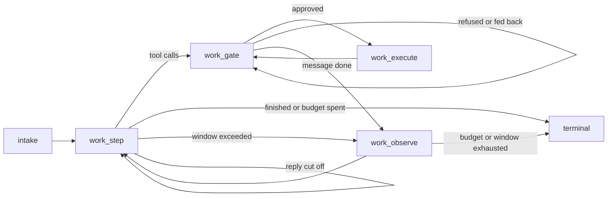

# The coding harness

How `tamoz code` carries a long coding task: a durable tool-calling loop, a
context engine that keeps the conversation inside the model's window, and a
harness protocol that says how the model should work. For how to use it, see
[guides/coding.md](../guides/coding.md).

Source: the working record in `docs/coding-harness/` (the plan, the
context-engine mapping, the prompt design, the eval plan, and the resume point in
`STATUS.md`). If this summary and that record disagree, the record wins.

Current version: `0.1.0.alpha.1` (pre-release).

## What was missing, and what was reused

Before the harness, Tamoz could make one bounded, reviewed change: plan, review,
one approved patch, one check, up to two repairs. Each model call was a single
system/user pair in JSON mode. Three things were added:

1. **A model conversation.** `EpisodeModelTransport#converse` sends a growing
   message history with native tool calls. It returns the provider's raw usage,
   and it maps a provider's "context too long" reply to `context_window_exceeded`.
2. **A context engine** (`tamoz-context-engine`) that keeps that history inside
   the window without breaking the provider's prompt cache.
3. **A harness protocol** (`tamoz-harness`): the prompt pack, the persona and
   preferences, project guidance, the living plan, tool-call parsing, loop
   budgets and the finish contract.

Everything else is reused rather than rebuilt: the durable graph, the effect
journal (`EffectDispatcher`), the approval engine and its policy YAML, the
content-addressed artifact store, the sealed capability host, and the context
controls (`/new`, `/reset`, `/compact`, `/usage`, `/context`).

## The work loop

The work route is a graph version of the durable session in
`tamoz-agent-session`:

- **`work_step`** makes one model call through `SessionEffects#converse`. It is
  journaled as an `:idempotent` effect keyed on the request bytes, so a replay
  returns the recorded answer instead of calling the model again.
- **`work_gate`** takes the calls from one model message, one at a time. It
  checks each against the plan, the scope, the repeat guard, and read-before-edit
  freshness, then asks the approval engine. A refusal becomes a tool result the
  model reads. It is never an exception.
- **`work_execute`** runs one approved call through the effect journal. A patch
  binds the file's SHA-256, so a crash after the write is reconciled from the
  file on disk and never applied twice.
- **`work_observe`** measures the surface against the window, then spills,
  prunes or compacts it (below) before the next step.

Each turn is a fresh execution. It opens a new surface seeded with the previous
turn's answer, or its handoff note, and it carries the accepted plan forward.

**Budgets.** `Harness::LoopPolicy` bounds a turn: 60 model calls, 120 tool calls,
1800 seconds, and a repeat guard that reminds at 3 identical calls and stops at
8. The graph's super-step limit stays as a backstop behind those budgets. The
work graph compiles its step limit from the loop policy's worst case per model
call, so the budget ends a turn with a handoff before that backstop is reached.

## The context engine

The method follows the DeepSeek Harness (`dsh`) context design, mapped onto
Tamoz. The rule behind all of it: the provider's prompt cache is prefix-exact, so
the loop appends and never rewrites.

| Mechanism | What it does |
|---|---|
| Frozen request header | System prompt and tool schemas fixed for a request series, with their digest recorded, so every request extends the previous one byte for byte |
| Append-only surface | Every model-visible message is a logged entry. Tool calls and results are stored by reference, and checkpoints hold references only |
| In-history updates | Operator changes (`/think`, `/verbose`, a plan re-read, a repeat reminder) are appended as update messages. The header is never edited |
| Spill | A tool result over the inline limit (8 KB) goes to the artifact store. The model sees a head, a tail and a locator, and reads more with `recall_output` |
| Pruner | Old tool results outside the retained recent tail are cut to a head and a tail |
| Compaction | At 80% of the window (at a plan boundary) or 92% (anywhere), the history is summarized, once per turn, into a fixed-section summary: plan state, files, errors, decisions, ruled out, exact strings, next step. This starts a new request series |
| Handoff | Pressure after that one compaction, or a second overflow, ends the turn with a handoff note |
| Token meter | Estimates tokens before a request and recalibrates from the provider's reported usage. It also records cache hits |

The window comes from the profile role, then `TAMOZ_CONTEXT_WINDOW`, then the
recorded route in `gems/tamoz-agent-kernel/data/model_windows.yml`. A route with
no recorded window is refused rather than guessed.

## The harness protocol

- **The prompt pack** is a set of files under `gems/tamoz-harness/prompts/`
  (identity, operating rules, tools, editing, finish, surface, and the update
  messages), pinned by digest. Wording is data, not Ruby literals.
- **Trust tiers.** The prompt pack and the operator persona are trusted.
  Project guidance (`--guidance`) is shown as project data. It can shape
  conventions, but it cannot grant a tool, a path or an approval. A test checks
  that injected guidance grants nothing.
- **The living plan.** `update_plan` records the goal, the done-when criteria,
  the scope (paths and checks) and the steps. A separate plan-review call accepts
  or rejects it. Mutations before an accepted plan, or outside its scope, are
  refused. Widening the scope goes back to review.
- **The finish contract.** A turn that stops calling tools is classified from
  facts, not from the model's claim. `done` needs a file change and a
  configured check that passed after the last change.

## Evidence

- **Offline:** the work-loop tests drive scripted conversations through the real
  graph, journal and approval engine. They cover crash replay, a patch never
  applied twice, compaction, overflow, the repeat guard, a cut-off reply, and a
  budget handoff. The `agenteval` packs and adapters for real-model runs are
  built, and `rake agenteval:prove` validates them offline.
- **Real model:** one real end-to-end task, and one follow-up change, over
  OpenRouter DeepSeek v4.1 Flash on 2026-09-23 (see the guide's worked example).
  The runs exposed three harness defects and review found a fourth; all four
  are fixed, each with a test that fails without the fix. The real-model evaluation
  suite has not run yet; see [limitations](../limitations.md#the-coding-harness-has-one-real-task-run-not-a-real-model-evaluation).
