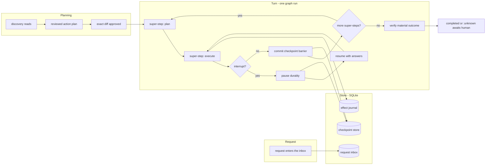

# Core concepts

This page is the mental model behind Tamoz. It introduces the five ideas everything else hangs on — the graph run, the checkpoint store, the reviewed change loop, durable sessions, and the authority boundary — and how they compose into one agent turn.

Current version: `0.1.0.alpha.1` (pre-release). Terminology is stable within this version; the public vocabulary may move before 1.0.

## The agent turn is a graph run over a checkpoint store

An agent turn is a **graph run**: a directed graph of nodes executes in barrier-synchronized super-steps (plan → execute → commit), and every committed barrier is written to a SQLite-backed checkpoint store before the next super-step begins. That single decision buys the whole durability story:

- **It survives `kill -9`.** A turn killed at any point resumes from its last committed barrier. Work after the last barrier may re-execute; invariant 21 governs whether that replay is safe.
- **It resumes by construction, not by convention.** Resume values match interrupt calls positionally; an answer can never reach the wrong question.
- **It reconciles interrupted effects from proven state.** An effect's journal row records what was attempted, not a guess about what happened.

A checkpoint makes the run's *state* durable. It never claims the run's external *effects* happened exactly once — that distinction is the second load-bearing rule (see [../architecture/overview.md](../architecture/overview.md)).

## The reviewed change loop

When the agent is allowed to change files, every material action follows the same loop:

1. **Discovery reads** gather evidence with read-only capabilities only.
2. A **separately reviewed action plan** is persisted and bound to its canonical digest.
3. The **exact diff is shown** before any approval.
4. A **digest-bound atomic patch** is applied — a mutation between approval and dispatch is refused.
5. A **configured verification command** runs; the model may choose which configured check to run but can never alter its program, arguments, or environment.

A failed check becomes evidence for up to two newly reviewed repairs with fresh approvals. A repeated action or a repeated failure **stops safely** rather than looping.

## Durable multi-turn sessions

A durable session is one thread of execution living in the checkpoint store. The CLI drives it with a small set of subcommands:

| Subcommand | What it does |
|---|---|
| `ask` | Start a new turn on a thread |
| `resume` | Answer the approvals or questions a paused thread is waiting on |
| `continue` | Drive a paused thread forward without new input |
| `follow-up` | Queue another turn behind the current one |
| `redirect` | Replace the goal of an in-flight turn |
| `cancel` | Route a thread to a terminal cancellation |
| `show` | Render one thread's state, plan digest, receipts and outcome |
| `list` | Show every thread in the session directory |
| `resolve` | Record a human decision about an `:unknown` effect |

Exit codes are part of the contract: `0` completed and verified, `1` fatal error, `2` completed but not satisfied, `3` paused or blocked, `64` usage error, `130`/`143` interrupted by `SIGINT`/`SIGTERM`.

## Trusted profiles and the authority boundary

Project authority lives **outside the repository being worked on**. A file in an untrusted checkout can suggest configuration; it never becomes executable authority without an explicit import and preview. Profiles are schema-v1 YAML, digest-pinned (`sha256:`), loaded with `O_NOFOLLOW`/`O_NONBLOCK`, and contain no secrets in the file.

At session construction, the capability registry is built from four built-in sources — **local tools, skills, MCP servers, and websearch** — and then **sealed**. The authority intersection is computed once from policy; content never grants. See [../architecture/security-model.md](../architecture/security-model.md).

## The rest of the model in one list

- **Three-layer memory.** Experience | Knowledge | Wisdom — distinct versioned layers with provenance, authority, and promotion rules. Wisdom changes only through evaluated behavior transition.
- **Bounded self-healing.** The durable-recovery circuit (internal name DR-2) spans four scopes (`server`, `rule_target`, `schedule`, `egress`); remediation is typed, reviewed, and bounded.
- **Durable scheduling.** A due occurrence is materialized as an ordinary request into the request inbox — the scheduler never executes work itself.
- **Observability.** A closed signal catalog, a bounded local journal, and metrics/trace projection; secrets are rejected from signals by construction.
- **The stream runtime.** One sealed, digest-verified Situation snapshot per episode, delivered through the gRPC EpisodeWorker. The continuous plane (event time, watermarks, windows, replay) belongs to the stream runtime, not to Tamoz.

## Next reads

- [product.md](product.md) — what Tamoz is and who it is for
- [../architecture/overview.md](../architecture/overview.md) — the layered stack and runtime model
- [../architecture/data-model.md](../architecture/data-model.md) — what the checkpoint store actually holds
- [../getting-started/sessions.md](../getting-started/sessions.md) — durable sessions in practice
